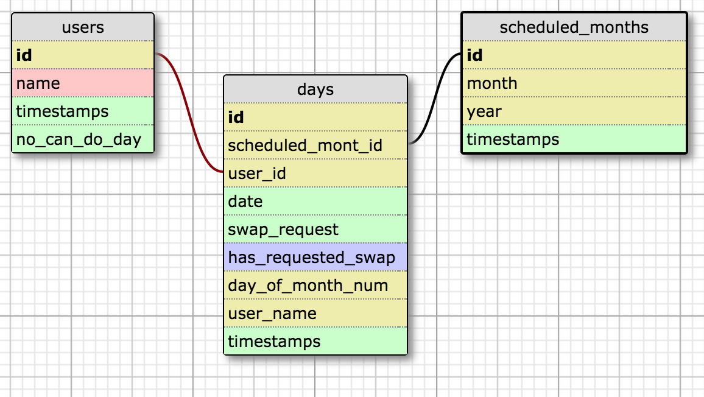
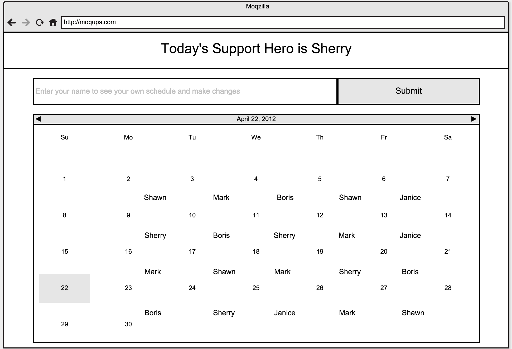
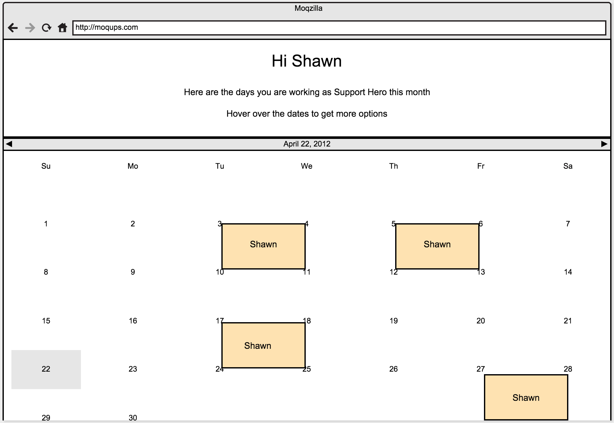

# Support Hero  

## Description

This is a scheduling application that stores and displays the on-duty days for a team.  Every day, one person is given the duty of Support Hero.  This application allows user to check and manage their schedule.

## How to use

The index page shows the name of support hero of the day and a calendar month with the users that are assigned to each day.  

To navigate to the user profile page you can either type your first name into the find form or you can find your name(which is linked to your profile) in the calendar and click on it.

Once on the show page, users can see and mangae their profile.

Users may mark one day a month as undoable.  If they do this, the user that has been assigned the least number of days (that hasn't marked the day as undoable) so far will be scheduled to work that day.

Users may also choose to swap days.  This process has two steps:  

1. The user asks another user to swap a day
2. The user being asked can then accept or deny the request.

Limits:

* The user cannot ask to swap the same day with multiple people. for example: if I asked to swap January 1st, 2015 with Mark and (before mark could confirm or deny my request) I asked to swap January 1st, 2015 with Amy, the system would give the user an error telling them it's not possible.
* The user will be given an error if they ask to swap a day that someone else has asked (but not been answered).

## Assumptions

* You are running the app in California. The apps scheduling takes into account California holidays.
* You do not want to schedule users on the weekends.
* Only one person is scheduled per day.
* You must wait for someone to accept or deny a swap request before you can ask for another on the same date. This is to prevent users from asking everyone on the team to swap at once.

## Getting Started

(assuming you have Ruby >= 2.0.0 , Git and Rails > 4.0.0 installed)

1. git clone https://github.com/lukasjones/support_hero.git
2. cd support_hero
3. bundle install
4. rake db:create db:migrate 
5. rake db:seed **before running rake db:seed go into the seed file and change the starting order to the names you want(first names only)**.
6. rails s

open up your browser of choice and type http://localhost:3000/

## Deploy online (with Heroku)
here is a [link](http://support-heroes.herokuapp.com) to an already deployed version

(I am assuming you have an account with heroku and have the heroku CLI tools installed)

1. follow steps in "Getting Started" section.

- (the next steps are in Terminal)

2.  heroku create
3. git push heroku master (this step takes a while)
4. heroku run rake db:create db:migrate db:seed
5. heroku open (this will open up the website in your preferred web browser)

## Schema Design

## Class Design

ScheduledMonth
- month and year must be unique
- has method to create month and all the days in the month 

Day
- belongs to a user
- belongs to a scheduled month

User
- users have many days
- users can mark a day as undoable
- through days class a user can ask another user to swap one of their own days

## UI Design

Mockups

 

